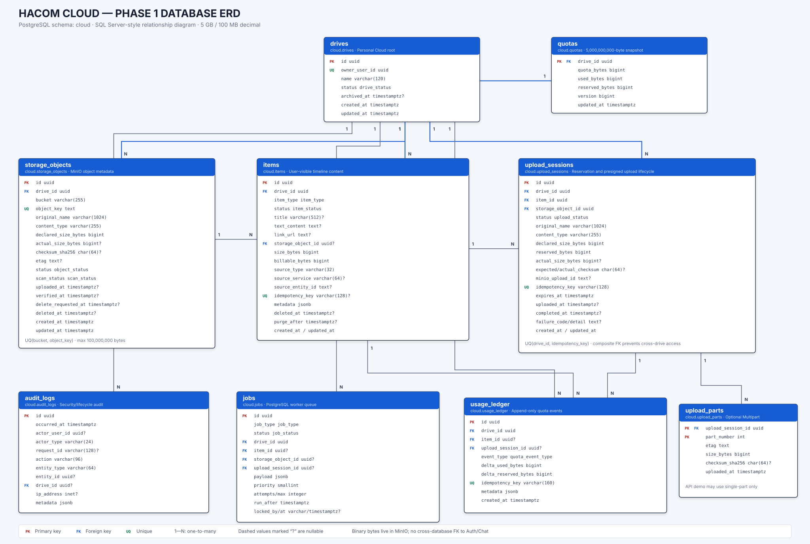
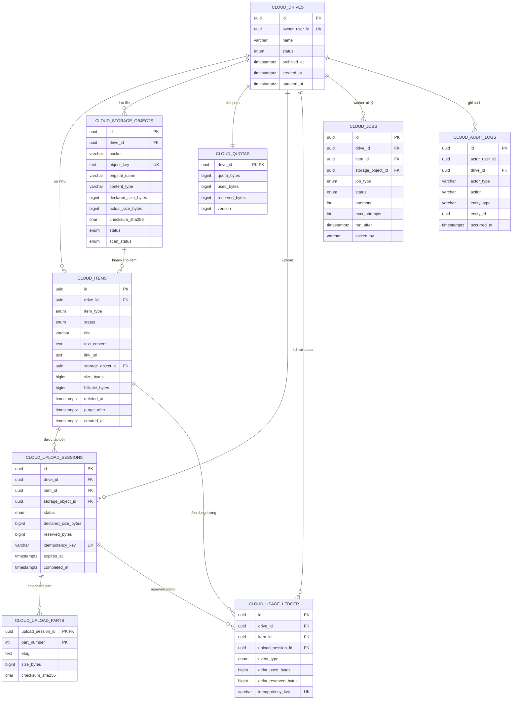

# Báo cáo xác nhận thiết kế CSDL Hacom Cloud — Phase 1

> Ngày cập nhật: 28/07/2026  
> Database: PostgreSQL 16  
> Object Storage: MinIO  
> Phạm vi: Personal Cloud dạng timeline, chưa có Folder và chưa kết nối Chat

## 1. Kết luận nhanh

Thiết kế hiện tại **đủ chặt chẽ và phù hợp để triển khai Phase 1**:

- Mỗi người dùng chỉ có một Personal Cloud.
- Mỗi người có chính xác `5,000,000,000 bytes` quota.
- Mỗi nội dung tối đa `100,000,000 bytes`.
- Text, link và file đều tính quota.
- File binary nằm trong MinIO; PostgreSQL chỉ lưu metadata.
- Upload giữ chỗ quota trước khi cấp presigned URL.
- Có idempotency để request retry không cộng dung lượng hai lần.
- Item trong thùng rác vẫn tính quota.
- Sau 24 giờ, Worker purge và mới giải phóng quota.
- Database ngăn dữ liệu người A tham chiếu nhầm dữ liệu người B.
- Nhân viên nghỉ việc không làm dữ liệu bị cascade theo Auth.
- Chưa triển khai dedup, nhưng đã lưu SHA-256 để phát triển sau.

Thiết kế có 9 bảng nghiệp vụ trong schema riêng `cloud`.

## 2. Dữ liệu nằm ở đâu?

```text
PostgreSQL
├── Người sở hữu Cloud
├── Text và link
├── Metadata file
├── Trạng thái upload
├── Quota và lịch sử dung lượng
├── Worker job
└── Audit log

MinIO
└── Binary thật của ảnh, video, audio và file
```

Ví dụ file `baocao.pdf`:

```text
PostgreSQL:
  tên file       = baocao.pdf
  dung lượng     = 2,400,000 bytes
  content type   = application/pdf
  object key     = users/.../baocao.pdf
  checksum       = SHA-256
  trạng thái     = ready

MinIO:
  2,400,000 bytes dữ liệu thật của file
```

PostgreSQL và MinIO lưu độc lập về mặt công nghệ nhưng liên kết bằng `storage_object_id` và `(bucket, object_key)`.

## 3. ERD tổng thể



> Mở trực tiếp file `phase1-erd-sql-style.svg` để phóng to và xem tên cột, kiểu dữ liệu, PK/FK/UQ giống Database Diagram trong SQL Server.



## 4. Giải thích từng bảng

### 4.1 `cloud.drives`

Đại diện cho kho cá nhân của người dùng, không phải folder.

```text
Một owner_user_id → đúng một cloud.drives
```

`owner_user_id` là UUID từ Auth Service nhưng không tạo foreign key sang Auth Database. Khi tài khoản nghỉ việc hoặc bị khóa, Drive vẫn còn và có thể chuyển sang `suspended/archived`.

### 4.2 `cloud.items`

Đại diện nội dung người dùng nhìn thấy trên timeline:

```text
text | link | file | image | video | audio
```

- Text lưu trực tiếp trong `text_content`.
- Link lưu trong `link_url`.
- File/ảnh/video/audio trỏ tới `storage_object_id`.
- `billable_bytes` là số byte tính quota.
- `deleted_at` và `purge_after` phục vụ thùng rác 24 giờ.

Không có `parent_id`, vì Phase 1 chưa xác nhận Folder.

### 4.3 `cloud.storage_objects`

Đây là metadata của binary trong MinIO:

```text
bucket + object_key → vị trí file thật
checksum_sha256     → kiểm tra toàn vẹn và chuẩn bị dedup
status              → lifecycle object
scan_status         → kết quả virus scan sau này
```

Checksum không đặt unique trong Phase 1, nên chưa tự động dùng chung file.

### 4.4 `cloud.upload_sessions`

Quản lý một lần upload:

- File dự kiến bao nhiêu byte.
- Đã giữ bao nhiêu quota.
- Presigned upload còn hạn không.
- Object đã upload/complete chưa.
- Request có bị retry không.

Unique `(drive_id, idempotency_key)` ngăn client bấm hai lần tạo hai reservation.

### 4.5 `cloud.upload_parts`

Lưu từng phần của Multipart Upload. Phase 1 có thể chưa sử dụng bảng này.

### 4.6 `cloud.quotas`

Snapshot dung lượng hiện tại:

```text
quota_bytes    = 5,000,000,000
used_bytes     = nội dung đã lưu
reserved_bytes = upload đang thực hiện
```

Database luôn kiểm tra:

```text
used_bytes + reserved_bytes <= quota_bytes
```

### 4.7 `cloud.usage_ledger`

Lịch sử bất biến của quota:

```text
reserve   giữ chỗ trước upload
commit    chuyển reserved thành used
release   trả lại reservation
consume   lưu text/link
purge     xóa vĩnh viễn và giảm used
reconcile sửa sai lệch khi đối soát
```

Ledger giúp tìm nguyên nhân khi quota snapshot bị lệch.

### 4.8 `cloud.jobs`

Hàng đợi Worker trong PostgreSQL:

```text
verify_upload
hash_file
virus_scan
create_thumbnail
cleanup_expired_upload
permanent_delete
reconcile_quota
```

Phase 1 chưa cần Kafka. Worker lấy job bằng `FOR UPDATE SKIP LOCKED`.

### 4.9 `cloud.audit_logs`

Ghi lại ai đã upload, xóa, restore, thay quota hoặc thực hiện thao tác quản trị.

Audit không lưu:

- Nội dung text/file.
- Access token.
- Presigned URL.
- MinIO secret.

## 5. Luồng upload

```text
1. Client gửi tên, MIME type, size và idempotency key.
2. API kiểm tra size <= 100,000,000 bytes.
3. API reserve quota.
4. Tạo Item pending.
5. Tạo Storage Object reserved.
6. Tạo Upload Session.
7. Trả presigned URL.
8. Client upload trực tiếp vào MinIO.
9. Client gọi complete.
10. API kiểm tra object và chuyển reserved → used.
11. Tạo Worker Job.
12. Worker hash/verify rồi chuyển Item/Object thành ready.
```

Các bước 3–6 phải nằm trong cùng một transaction. Nếu một bước lỗi, toàn bộ rollback.

## 6. Luồng xóa và restore

### Xóa

```text
status       = trashed
deleted_at   = thời điểm xóa
purge_after  = deleted_at + 24 giờ
```

File vẫn nằm trong MinIO và vẫn tính quota.

### Restore trước 24 giờ

```text
status       = ready
deleted_at   = null
purge_after  = null
```

Quota không thay đổi.

### Sau 24 giờ

Worker:

1. Xóa binary trong MinIO.
2. Ghi audit.
3. Ghi ledger `purge`.
4. Giảm `used_bytes`.
5. Xóa Item và dữ liệu Upload Session phụ thuộc.

## 7. Hai khái niệm kỹ thuật cần hiểu

### 7.1 Multipart là gì?

Multipart là chia một file thành nhiều phần:

```text
file 90 MB
├── part 1: 10 MB
├── part 2: 10 MB
├── ...
└── part 9: 10 MB
```

Ưu điểm:

- Mạng lỗi chỉ upload lại part bị lỗi.
- Upload song song nhanh hơn.
- Phù hợp file lớn.

Đề xuất cho Phase 1:

- Giữ bảng `cloud.upload_parts` trong database.
- Demo đầu tiên chỉ cần single-part presigned URL.
- Khi làm Multipart thật sẽ không phải đổi schema.

Tức là có bảng không đồng nghĩa tuần đầu bắt buộc code Multipart.

### 7.2 Vì sao cần `storage_objects` riêng?

Nếu gộp file vào `cloud.items`, timeline và file vật lý bị dính chặt:

```text
Xóa Item → khó quyết định có xóa MinIO ngay không
Restore   → khó khôi phục object lifecycle
Dedup     → không thể nhiều Item dùng một object
Version   → phải sửa toàn bộ bảng Item
Chat copy → khó tách dữ liệu Cloud khỏi Chat
```

Khi tách riêng:

```text
Cloud Item             Storage Object
"Báo cáo tháng 7"  →   bucket/key/checksum/size
```

Item là thứ người dùng nhìn thấy. Storage Object là file kỹ thuật.

Đây là cách nên giữ, dù Phase 1 chưa làm dedup hoặc version.

## 8. Những ràng buộc database đã kiểm thử

- Không tạo hai Personal Drive cho cùng user.
- Không chấp nhận file lớn hơn 100,000,000 bytes.
- Không để quota vượt 5,000,000,000 bytes.
- Không để Upload Session của Drive A trỏ Item/Object Drive B.
- Không cho binary Item thiếu Storage Object.
- Không cho một idempotency key cộng quota hai lần.
- Purge Item tự xóa Upload Session/Part phụ thuộc.
- Purge vẫn giữ Usage Ledger để đối soát.
- Migration up/down chạy lặp lại được.

## 9. Những gì chưa tạo trong Phase 1

```text
Folder
Share public/private
File version
Dedup vật lý
Quota approval request
Kafka outbox
AI document/chunk/embedding
Liên kết Chat thật
```

Các chức năng trên phải được thêm bằng migration mới, không sửa migration Phase 1 sau khi đã merge.

## 10. Kết luận

Thiết kế database hiện tại có thể dùng làm nền tảng code cho API, Upload Service và Worker.

Hai quyết định kỹ thuật được đề xuất chốt:

1. Giữ `cloud.upload_parts`, nhưng chưa bắt buộc demo Multipart.
2. Giữ `cloud.storage_objects` riêng biệt với `cloud.items`.

Hai quyết định này không làm Phase 1 phức tạp hơn đáng kể nhưng tránh phải phá schema khi phát triển tiếp.
