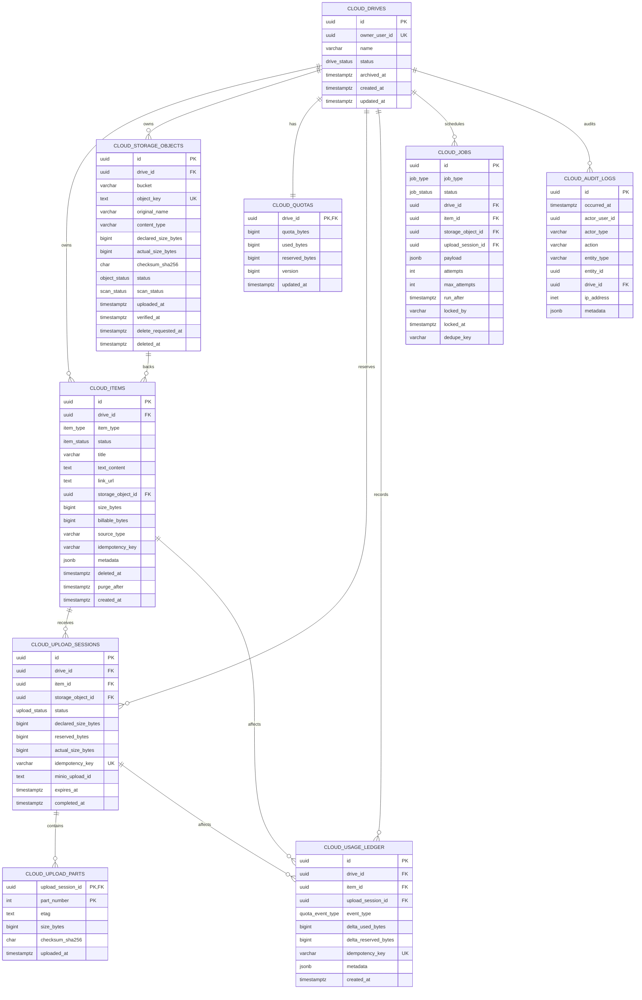

# Hacom Cloud Phase 1 — ERD

> Trạng thái: đề xuất triển khai  
> Phạm vi: Personal Cloud dạng timeline, chưa có Folder, Share, Chat integration hoặc Version History

## ERD

## Biên sở hữu dữ liệu

- `owner_user_id` và `actor_user_id` là UUID lấy từ JWT/Auth Service.
- Cloud Database không tạo foreign key sang `auth.users` vì Auth là service và database độc lập.
- PostgreSQL lưu identity, metadata, lifecycle, quota và job.
- MinIO lưu binary. Cặp `(bucket, object_key)` là vị trí duy nhất của object.
- `source_*` chỉ là soft reference để Phase sau copy từ Chat; xóa tin nhắn Chat không xóa Cloud Item.

## Quan hệ quan trọng

| Quan hệ | Cardinality | Chính sách xóa |
|---|---:|---|
| Drive → Item | 1:N | `RESTRICT`; phải purge item trước |
| Drive → Storage Object | 1:N | `RESTRICT`; phải cleanup MinIO trước |
| Drive → Quota | 1:1 | `CASCADE` khi drive thật sự bị xóa |
| Item → Storage Object | N:1 | `RESTRICT`; cho phép dedup/reference sau này |
| Item/Object → Upload Session | 1:N | `CASCADE`; session là dữ liệu kỹ thuật phụ thuộc |
| Upload Session → Upload Part | 1:N | `CASCADE` |
| Ledger → Item/Upload | N:1 | Xóa entity chỉ xóa soft reference, giữ lịch sử |
| Job → Entity | N:1 | Giữ job history, entity reference có thể về `NULL` |

Composite foreign key `(entity_id, drive_id)` ngăn tuyệt đối việc session, ledger hoặc job của người A trỏ nhầm dữ liệu người B.
