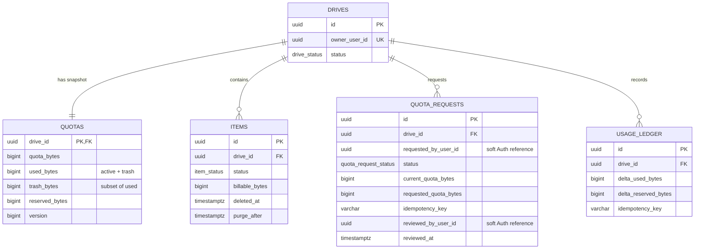

# ERD Phase 2 — migration baseline

Phạm vi của ERD này là persistence contract do migration `000005` bổ sung. Các bảng
Phase 1 vẫn giữ nguyên; API Trash và nghiệp vụ duyệt quota chưa được triển khai ở
quy trình này.

Quan hệ tới người dùng Auth là soft UUID reference, không tạo foreign key xuyên
service. Mỗi drive có tối đa một quota request `pending`, được bảo vệ bởi unique
partial index.
